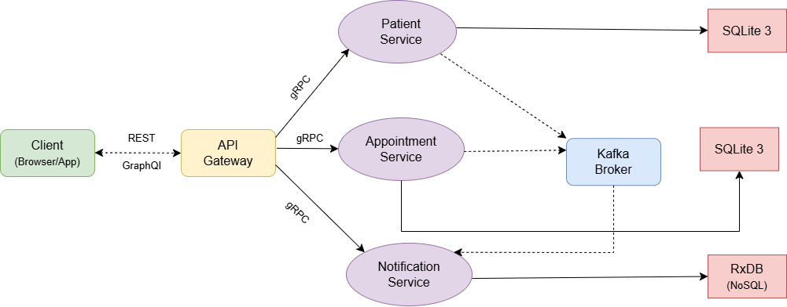

# 🏥 Smart Hospital Management System

> **Microservices Architecture** — Node.js · gRPC · Apache Kafka 4.0 · REST · GraphQL · SQLite3 · RxDB · Docker  
> Academic Project — SoA et Microservices — Dr. Salah Gontara — A.U. 2025-26

---

## 📌 Table of Contents

- [Project Description](#-project-description)
- [Architecture](#-architecture)
- [Services Overview](#-services-overview)
- [Kafka Topics](#-kafka-topics)
- [Project Structure](#-project-structure)
- [Installation & Setup](#-installation--setup)
- [REST API Reference](#-rest-api-reference)
- [GraphQL API Reference](#-graphql-api-reference)
- [Proto Files](#-proto-files)
- [Databases](#-databases)
- [Technologies Used](#-technologies-used)
- [Authors](#-authors)

---

## 📋 Project Description

The **Smart Hospital Management System** is a distributed application built with a microservices architecture using **Node.js exclusively**. The system handles patient registration, appointment booking and cancellation, and automated notifications through three independent microservices.

The project demonstrates:
- Clear separation of responsibilities between microservices
- Synchronous communication via **gRPC over HTTP/2 with Protobuf**
- Asynchronous event-driven communication via **Apache Kafka 4.0**
- A unified API entry point exposing both **REST** and **GraphQL** interfaces
- Independent databases per microservice (**SQLite3** and **RxDB**)
- Full containerization with **Docker and Docker Compose**

---

## 🏗️ Architecture



The application follows this architecture:

- The **Client** (browser or app) communicates with the **API Gateway** using REST and GraphQL over HTTP/1.1 with JSON
- The **API Gateway** is the single entry point — it translates REST and GraphQL requests into **gRPC calls** directed to the appropriate microservice over HTTP/2
- The **3 microservices** each expose a gRPC interface, own their database, and communicate asynchronously through the **Kafka Broker**
- **Patient Service** and **Appointment Service** publish events to Kafka topics
- **Notification Service** consumes all Kafka topics and stores notifications in RxDB

---

## 🧩 Services Overview

| Service | Responsibility | Interface | Port | Database |
|---|---|---|---|---|
| API Gateway | Single entry point — REST + GraphQL | HTTP/1.1 + GraphQL | 4000 | None |
| Patient Service | Create and manage patient records | gRPC / HTTP/2 | 50051 | SQLite3 |
| Appointment Service | Book and cancel appointments | gRPC / HTTP/2 | 50052 | SQLite3 |
| Notification Service | Store and serve event notifications | gRPC / HTTP/2 | 50053 | RxDB (NoSQL) |
| Kafka Broker | Asynchronous event bus | Kafka 4.0 KRaft | 9092 | — |

---

## 📨 Kafka Topics

| Topic | Producer | Consumer | Triggered When |
|---|---|---|---|
| `patient.created` | Patient Service | Notification Service | A new patient is registered |
| `appointment.created` | Appointment Service | Notification Service | An appointment is booked |
| `appointment.cancelled` | Appointment Service | Notification Service | An appointment is cancelled |

### Kafka Event Flow

```
1. Client creates a patient or books/cancels an appointment
2. The service saves the data to its own database (SQLite3)
3. The service publishes a JSON event to the corresponding Kafka topic
4. The service immediately responds to the API Gateway (non-blocking)
5. Meanwhile — Notification Service receives the event from Kafka
6. Notification Service saves the notification to RxDB
```

> Kafka ensures services are fully decoupled. Patient Service and Appointment Service do not know Notification Service exists. If Notification Service is down, messages wait in Kafka — nothing is lost.

---

## 📁 Project Structure

```
hospital-management/
│
├── proto/
│   ├── patient.proto            # gRPC contract — Patient Service
│   ├── appointment.proto        # gRPC contract — Appointment Service
│   └── notification.proto       # gRPC contract — Notification Service
│
├── api-gateway/
│   ├── src/
│   │   ├── index.js             # Express server — REST routes + Apollo GraphQL
│   │   ├── grpcClients.js       # gRPC client stubs for all 3 microservices
│   │   ├── schema.js            # GraphQL type definitions
│   │   └── resolvers.js         # GraphQL resolvers — call gRPC clients
│   ├── Dockerfile
│   └── package.json
│
├── patient-service/
│   ├── src/
│   │   ├── index.js             # gRPC server — patient CRUD logic
│   │   ├── db.js                # SQLite3 database initialization
│   │   └── kafkaProducer.js     # Publishes patient.created to Kafka
│   ├── data/                    # SQLite3 database file (persisted via volume)
│   ├── Dockerfile
│   └── package.json
│
├── appointment-service/
│   ├── src/
│   │   ├── index.js             # gRPC server — appointment logic
│   │   ├── db.js                # SQLite3 database initialization
│   │   └── kafkaProducer.js     # Publishes appointment.created / cancelled
│   ├── data/                    # SQLite3 database file (persisted via volume)
│   ├── Dockerfile
│   └── package.json
│
├── notification-service/
│   ├── src/
│   │   ├── index.js             # gRPC server — list notifications
│   │   ├── db.js                # RxDB in-memory database initialization
│   │   └── kafkaConsumer.js     # Consumes patient.created, appointment.*
│   ├── Dockerfile
│   └── package.json
│
├── docker-compose.yml           # Orchestrates all 5 containers
├── .gitignore                   # Excludes node_modules, .db files
└── README.md
```

---

## 🚀 Installation & Setup

### Prerequisites

- [Docker Desktop](https://www.docker.com/products/docker-desktop/) installed and running
- [Git](https://git-scm.com/)

### Clone and Run

```bash
# 1 — Clone the repository
git clone https://github.com/AmalMselmi/hospital-management.git
cd hospital-management

# 2 — Create required data directories for SQLite3 persistence
mkdir -p patient-service/data appointment-service/data

# 3 — Build and start all containers
docker-compose up --build
```

Wait approximately **30–40 seconds** for Kafka to fully initialize. You will see these messages:

```
hospital-kafka                 | Kafka version: 4.0.0
hospital-patient-service       | [Patient Service] gRPC server running on port 50051
hospital-appointment-service   | [Appointment Service] gRPC server running on port 50052
hospital-notification-service  | [Kafka] Notification consumer connected
hospital-notification-service  | [Notification Service] gRPC server running on port 50053
hospital-api-gateway           | [API Gateway] HTTP server running on port 4000
```

### Access Points

| Interface | URL |
|---|---|
| REST API | http://localhost:4000/api/ |
| GraphQL Sandbox | http://localhost:4000/graphql |
| Health Check | http://localhost:4000/health |

### Stop the Project

```bash
# Stop all containers
docker-compose down

# Stop and remove all data (volumes)
docker-compose down -v
```

---

## 🔗 REST API Reference

**Base URL:** `http://localhost:4000`

---

### 👤 Patient Endpoints

#### Create a Patient
```
POST /api/patients
Content-Type: application/json

{
  "name": "Alice Ben Ali",
  "email": "alice@hospital.com",
  "phone": "0612345678",
  "age": 34
}
```

#### List All Patients
```
GET /api/patients
```

#### Get One Patient
```
GET /api/patients/:id
```

#### Update a Patient
```
PUT /api/patients/:id
Content-Type: application/json

{
  "name": "Alice Ben Ali",
  "email": "alice@hospital.com",
  "phone": "0612345678",
  "age": 35
}
```

#### Delete a Patient
```
DELETE /api/patients/:id
```

---

### 📅 Appointment Endpoints

#### Book an Appointment
```
POST /api/appointments
Content-Type: application/json

{
  "patient_id": "<patient-id>",
  "doctor_name": "Dr. Mansour",
  "date": "2026-06-01",
  "time": "10:00",
  "reason": "General checkup"
}
```

#### List All Appointments
```
GET /api/appointments
```

#### List Appointments for a Patient
```
GET /api/appointments?patient_id=<patient-id>
```

#### Get One Appointment
```
GET /api/appointments/:id
```

#### Update an Appointment
```
PUT /api/appointments/:id
Content-Type: application/json

{
  "doctor_name": "Dr. Ben Salem",
  "date": "2026-07-15",
  "time": "14:00",
  "reason": "Follow-up consultation"
}
```

#### Cancel an Appointment
```
DELETE /api/appointments/:id
```

---

### 🔔 Notification Endpoints

#### Get Notifications for a Patient
```
GET /api/notifications?patient_id=<patient-id>
```

---

### ✅ Health Check
```
GET /health

Response: { "status": "ok", "service": "api-gateway" }
```

---

### curl Examples

```bash
# Create a patient
curl -X POST http://localhost:4000/api/patients \
  -H "Content-Type: application/json" \
  -d '{"name":"Alice Ben Ali","email":"alice@hospital.com","phone":"0612345678","age":34}'

# List all patients
curl http://localhost:4000/api/patients

# Book an appointment
curl -X POST http://localhost:4000/api/appointments \
  -H "Content-Type: application/json" \
  -d '{"patient_id":"<id>","doctor_name":"Dr. Mansour","date":"2026-06-01","time":"10:00","reason":"Checkup"}'

# Get notifications for a patient
curl "http://localhost:4000/api/notifications?patient_id=<id>"

# Update an appointment
curl -X PUT http://localhost:4000/api/appointments/<id> \
  -H "Content-Type: application/json" \
  -d '{"doctor_name":"Dr. Ben Salem","date":"2026-07-15","time":"14:00","reason":"Follow-up consultation"}'

# Cancel an appointment
curl -X DELETE http://localhost:4000/api/appointments/<id>

# Delete a patient
curl -X DELETE http://localhost:4000/api/patients/<id>
```

---

## 📊 GraphQL API Reference

**Endpoint:** `http://localhost:4000/graphql`

Open in browser to access the **Apollo Sandbox** — an interactive interface to run queries and mutations.

---

### GraphQL Schema

```graphql
type Patient {
  id: String!
  name: String!
  email: String!
  phone: String!
  age: Int!
}

type Appointment {
  id: String!
  patient_id: String!
  doctor_name: String!
  date: String!
  time: String!
  reason: String!
  status: String!
}

type Notification {
  id: String!
  patient_id: String!
  message: String!
  type: String!
  created_at: String!
}

type DeleteResult {
  success: Boolean!
  message: String!
}

type Query {
  patient(id: String!): Patient
  patients: [Patient!]!
  appointment(id: String!): Appointment
  appointments(patient_id: String): [Appointment!]!
  notifications(patient_id: String): [Notification!]!
}

type Mutation {
  createPatient(name: String!, email: String!, phone: String!, age: Int!): Patient!
  updatePatient(id: String!, name: String!, email: String!, phone: String!, age: Int!): Patient!
  deletePatient(id: String!): DeleteResult!
  createAppointment(patient_id: String!, doctor_name: String!, date: String!, time: String!, reason: String!): Appointment!
  updateAppointment(id: String!, doctor_name: String!, date: String!, time: String!, reason: String!): Appointment!
  cancelAppointment(id: String!): DeleteResult!
}
```

---

### Query Examples

**List all patients:**
```graphql
query {
  patients {
    id
    name
    email
    phone
    age
  }
}
```

**Get one patient by ID:**
```graphql
query {
  patient(id: "PATIENT_ID") {
    id
    name
    email
    phone
    age
  }
}
```

**List appointments for a patient:**
```graphql
query {
  appointments(patient_id: "PATIENT_ID") {
    id
    doctor_name
    date
    time
    reason
    status
  }
}
```

**Get notifications — proves Kafka is working:**
```graphql
query {
  notifications(patient_id: "PATIENT_ID") {
    message
    type
    created_at
  }
}
```

---

### Mutation Examples

**Create a patient:**
```graphql
mutation {
  createPatient(
    name: "Alice Ben Ali"
    email: "alice@hospital.com"
    phone: "0612345678"
    age: 34
  ) {
    id
    name
    email
  }
}
```

**Book an appointment:**
```graphql
mutation {
  createAppointment(
    patient_id: "PATIENT_ID"
    doctor_name: "Dr. Mansour"
    date: "2026-06-01"
    time: "10:00"
    reason: "General checkup"
  ) {
    id
    status
    doctor_name
    date
  }
}
```

**Update a patient:**
```graphql
mutation {
  updatePatient(
    id: "PATIENT_ID"
    name: "Alice Ben Ali Updated"
    email: "alice2@hospital.com"
    phone: "0612345678"
    age: 35
  ) {
    id
    name
    email
  }
}
```

**Update an appointment:**
```graphql
mutation {
  updateAppointment(
    id: "APPOINTMENT_ID"
    doctor_name: "Dr. Ben Salem"
    date: "2026-07-15"
    time: "14:00"
    reason: "Follow-up consultation"
  ) {
    id
    doctor_name
    date
    time
    reason
    status
  }
}
```

**Cancel an appointment:**
```graphql
mutation {
  cancelAppointment(id: "APPOINTMENT_ID") {
    success
    message
  }
}
```

**Delete a patient:**
```graphql
mutation {
  deletePatient(id: "PATIENT_ID") {
    success
    message
  }
}
```

---

## 📄 Proto Files

The `proto/` folder contains the gRPC interface contracts shared between the API Gateway and each microservice. Both sides load the same `.proto` file — the gateway as a client, the service as a server.

### patient.proto

| RPC Method | Request | Response |
|---|---|---|
| `CreatePatient` | name, email, phone, age | PatientResponse |
| `GetPatient` | id | PatientResponse |
| `ListPatients` | — | ListPatientsResponse |
| `UpdatePatient` | id, name, email, phone, age | PatientResponse |
| `DeletePatient` | id | DeleteResponse |

### appointment.proto

| RPC Method | Request | Response |
|---|---|---|
| `CreateAppointment` | patient_id, doctor_name, date, time, reason | AppointmentResponse |
| `GetAppointment` | id | AppointmentResponse |
| `ListAppointments` | patient_id (optional) | ListAppointmentsResponse |
| `UpdateAppointment` | id, doctor_name, date, time, reason | AppointmentResponse |
| `CancelAppointment` | id | DeleteResponse |

### notification.proto

| RPC Method | Request | Response |
|---|---|---|
| `ListNotifications` | patient_id (optional) | ListNotificationsResponse |

---

## 🗄️ Databases

| Service | Database | Type | Location |
|---|---|---|---|
| Patient Service | SQLite3 | SQL / Relational | `patient-service/data/patients.db` |
| Appointment Service | SQLite3 | SQL / Relational | `appointment-service/data/appointments.db` |
| Notification Service | RxDB | NoSQL / In-memory | Runtime only (in container memory) |

> Each microservice has its own completely independent database. No service can access another service's database directly — all data access goes through gRPC.

---

## 🛠️ Technologies Used

| Technology | Version | Role |
|---|---|---|
| Node.js | 20 LTS | Runtime for all services |
| Express | 4.x | HTTP server in API Gateway |
| Apollo Server | 4.x | GraphQL server in API Gateway |
| graphql-tag | 2.x | GraphQL schema parsing |
| @grpc/grpc-js | 1.10.x | gRPC client and server implementation |
| @grpc/proto-loader | 0.7.x | Load .proto files at runtime |
| KafkaJS | 2.2.x | Kafka client for Node.js |
| better-sqlite3 | 9.x | SQLite3 synchronous driver |
| RxDB | 15.x | Reactive NoSQL in-memory database |
| Apache Kafka | **4.0.0** | Event broker — KRaft mode (no ZooKeeper) |
| Docker | — | Containerization of each service |
| Docker Compose | — | Multi-container orchestration |
| Bitnami Kafka Image | legacy | Production-grade Kafka 4.0 Docker image |

---

## 👥 Authors

- **Amal Mselmi** — [github.com/AmalMselmi](https://github.com/AmalMselmi)

---

*Smart Hospital Management System — SoA et Microservices — 2025-26*
